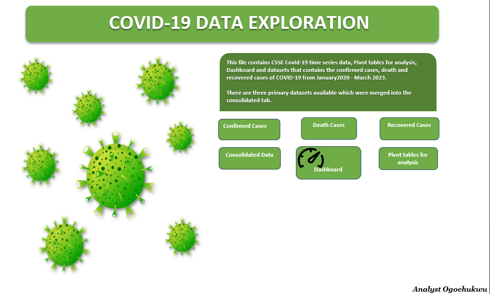
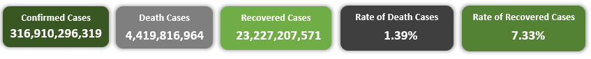
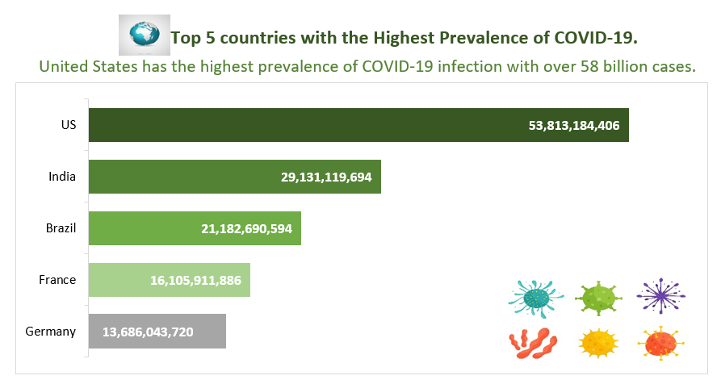
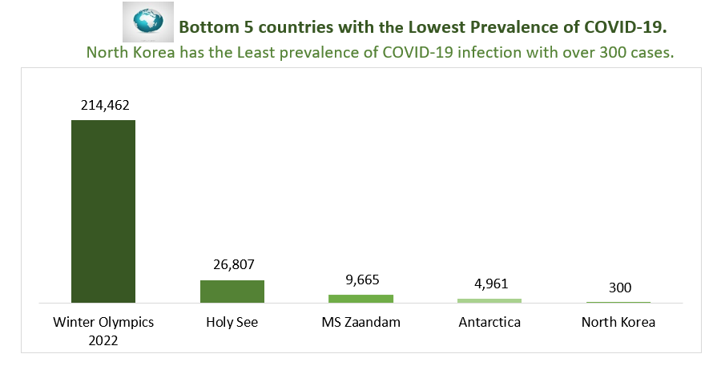
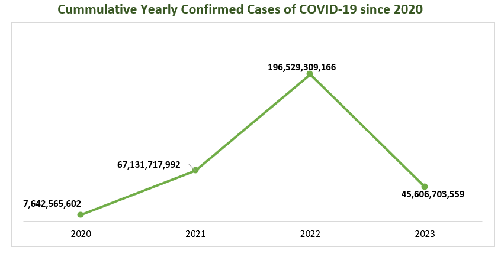

# Project name: COVID-19 Data Exploration and Insights.
## Home Tab

------

#### This is my first Excel Project. All the data cleaning,extraction and visualization process were done using Microsoft Excel.

The file comprises of 7 tabs which are:
- Home
- Analysis
- Dashboard
- Datasets (Confirmed,Death,Recovered and consolidated Cases)

--------
# Objective
- To analyze the top 5 and bottom 5 countries with the highest and lowest prevalence in COVID-19 from January 2020 - March 2023.
  
- To also analyze the cummulative yearly and monthly confirmed cases of COVID-19 since 2020.
  
- To get information of the rate of death and recovered cases.

  

-------

# Skills Demonstrated
I acquired skills in using Microsoft Excel to develop polished and user-friendly dashboards, as well as gathering data from the internet and refining it using the Power Query Editor.

----------

# Data Sourcing
- #### Data was scraped from the web into Excel so as to have a real time update.
- #### I retrieved the csse_covid_19_time_series tables from the CSSEGISandData/COVID19 repository on GitHub, which provides comprehensive data on global confirmed cases, recoveries, and deaths related to COVID-19.

-----------------

# Data Transformation and Cleaning
- The data was tidied and refined using the Power Query Editor to ensure its reliability and improve its quality.
  
- The three time series tables were merged/combined to create a unified and consolidated table.

- Tables were named accordingly.

- The colums were adjusted by upivoting some columns.

- New columns were added to separate the **Year, Month and Day**.

- Pivot tables were created for analysis purpose.

- Lastly, a dashboard was created.
  
#### The Pivot tables summarized the following:
 **A.**  Sum of Confirmed, Death and Recovered cases.
  
 **B.**  Sum of Confirmed cases by Years and Months(Monthly trend).
  
 **C.**  Rate of Death and Recovered Cases.
  
 **D.**  Top and Bottom 5 Countries with sum of confirmed cases.

------------

# Findings 

#### The rate of death cases is about 1.4% while that of recovered cases is about 7.4%
---

#### The United States recorded the highest number of COVID-19 cases, surpassing all other countries, with an alarming total of over 58 billion infections.
---

#### North Korea recorded the lowest number of COVID-19 cases with over 300 cases.
---

#### In the year 2022, there was a significant surge in COVID-19 cases, reaching an unprecedented number of approximately 196,529,309,166 confirmed cases.

